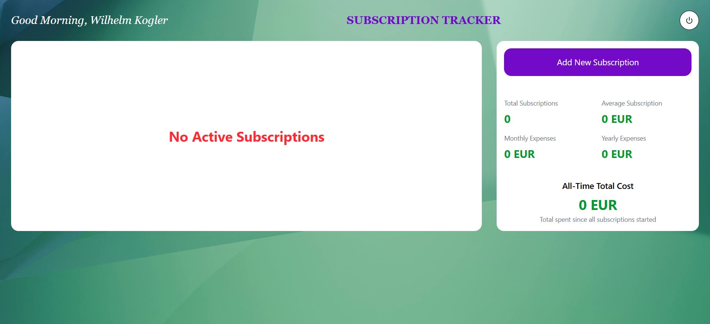

<h1>💸 Subscription Tracker Web Application </h1>

This web application is designed to help users track and manage their online subscriptions. After registering and logging in, users can add new subscriptions, edit existing ones, or delete them. The app also provides a variety of useful insights and statistics, such as monthly, yearly, and average costs, category distribution ratios, total all-time costs, charts, and other dynamic metrics.

<h2>Features</h2>

<ul>
  <li>User account creation</li>
  <li>Most expensive subscriptions list</li>
  <li>Interactive pie chart (category distribution)</li>
  <li>Bar chart (monthly cost by category)</li>
  <li>Line chart (active subscriptions over time)</li>
  <li>All-time cost by category and overall total</li>
  <li>Fully responsive</li>
</ul>

<h2>Tech Stack</h2>

Front-End: ReactJS, Tailwind CSS, JavaScript

Back-End: Firebase Cloud Functions

Database: Firebase

<h2>Account</h2>

The user can create an account through a login/register form and then sign in. This functionality is implemented using Firebase Authentication.

<h2>Empty Dashboard</h2>

After successful registration and login, the user is greeted with an empty dashboard where they can create their first subscription. Once a subscription is added, the UI dynamically updates to reflect the new data.

<h2>Add/Edit Subscription</h2>

Subscriptions can be created and edited through a modal window, which appears above the main content as a pop-up. Inside the modal, the user can fill out a form with all the required details, including the subscription name, price, currency, payment frequency, category, and start date.

<h2>Statistics</h2>

Once one or more subscriptions have been created, the application generates various statistics, metrics, charts, filters, and sorting options. Subscriptions are primarily displayed in a compact card view, arranged in four columns for easy readability and quick overview.

<h2>Table View</h2>

Of course, there is also the option to view the subscriptions in a standard, familiar table layout for easier and more structured overview.

<h2>Charts</h2>

We also have access to a Top 5 Most Expensive Subscriptions report, a Category-Based Cost and Proportion chart, and an All-Time Cost breakdown for each subscription.

<h2>Extra Stats</h2>

As well as a Line chart showing the number of subscriptions over the years, an Upcoming Payments list, and a total cost summary for all subscriptions, calculated from their respective start dates.

<h2>Dynamic Filter</h2>

We also have the ability to filter and sort subscriptions, with all metrics and statistics dynamically updating accordingly.

<h2>Pop Up Messages</h2>

For various interactions, such as logging out or deleting a subscription, the user is presented with dedicated pop-up confirmation dialogs, implemented using SweetAlert.

<h2>Responsive Design</h2>

To conclude, all pages and features have been built with full responsiveness in mind, ensuring
    accessibility across all smart devices. Most components are arranged in a vertical layout for optimal mobile
    viewing, and the power button in the top-right corner acts as the log-out button.

